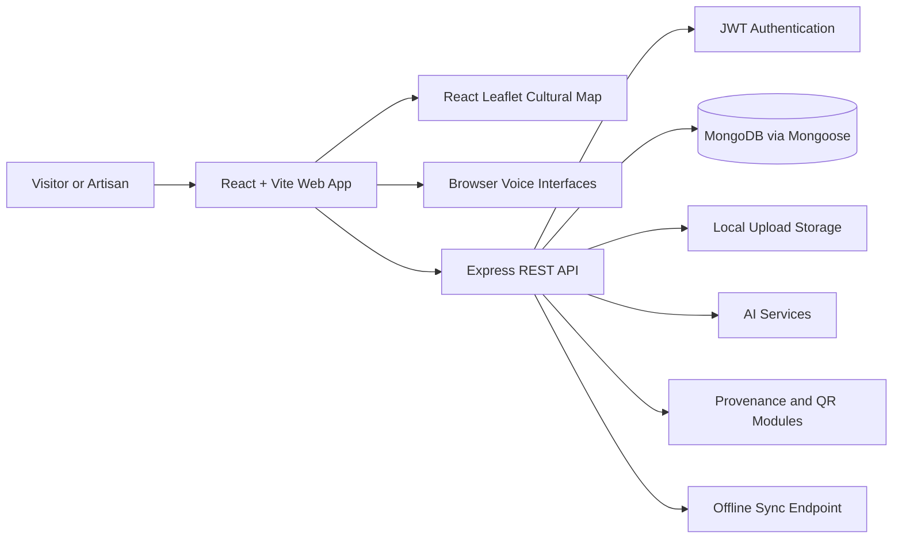

# DHAAGA

## Discover. Preserve. Support India's Living Heritage.

> A digital bridge between India's traditional artisans, living craft traditions, and the people who want to discover and sustain them.

DHAAGA is a cultural heritage discovery platform created for the **Smart India Hackathon**. It combines regional storytelling, interactive maps, artisan onboarding, voice assistance, and provenance-oriented technology to make India's craft communities more visible, accessible, and connected.

## The Problem

Traditional crafts carry generations of knowledge, but many artisan communities remain difficult to discover online. Their work is often separated from its cultural context, regional identity, and the story of the person who made it. Language, literacy, limited digital access, and unreliable connectivity can make existing digital platforms difficult to use.

DHAAGA addresses this gap by presenting craft as a living story rather than only as a product.

## Our Solution

DHAAGA creates one accessible digital space where people can:

- Discover regional crafts and the artisans behind them
- Understand the cultural story, place, and practice connected to each craft
- Explore craft origins through an interactive Cultural Map
- Register artisan profiles with voice-assisted form filling
- Share images, stories, experience, and craft identity
- Support direct connections between communities and visitors
- Build a foundation for provenance, verification, and responsible craft discovery

## Website Experience

### Home

The Home page introduces the purpose of DHAAGA through a featured Nirmal wooden toy craft, a clear discovery path, and an invitation for artisans to join the platform.

### Explore Crafts

The Explore page is a visual directory of craft traditions and registered artisans. Visitors can filter by craft category and open a dedicated story for each entry. Featured traditions include Nirmal wooden toys, Kondapalli toys, Cheriyal paintings, Kalamkari textiles, and Mangalagiri handloom weaving.

### Cultural Map

The Cultural Map connects craft traditions to their geographic origins. Selecting a craft card or map marker focuses the map on that location and opens the relevant image and story link. The current map includes Nirmal, Kondapalli, Cheriyal, Kalamkari, and Mangalagiri.

### Craft Stories

Each story page brings together the craft name, region, artisan identity, experience, cultural context, and the meaning behind the work. The goal is to preserve knowledge and help visitors see the human effort behind a handmade object.

### Artisan Registration

Artisans can share their name, craft type, location, phone number, story, years of experience, and profile photograph. The submitted profile becomes part of a growing digital directory of living heritage.

### Voice and Language Access

The registration experience supports voice-assisted form filling in English, Telugu, and Hindi. Speech can capture details such as a name, craft, location, phone number, story, and years of experience, reducing dependence on typing. Optional voice guidance is also available on the artisan information page.

## Current Craft Focus

DHAAGA currently highlights craft traditions from Telangana and Andhra Pradesh:

| Craft | Region | Heritage focus |
| --- | --- | --- |
| Nirmal Wooden Toys | Nirmal, Telangana | Painted wooden toys and family craft practice |
| Kondapalli Toys | Kondapalli, Andhra Pradesh | Hand-carved figures and local storytelling |
| Cheriyal Paintings | Cheriyal, Telangana | Narrative scroll painting and visual folklore |
| Kalamkari | Machilipatnam, Andhra Pradesh | Hand-painted and block-printed textiles |
| Mangalagiri Weaving | Mangalagiri, Andhra Pradesh | Handloom weaving and artisan identity |

## Architecture

DHAAGA follows a modular client-server architecture. The frontend provides the public discovery experience, while the backend exposes APIs for artisan profiles, crafts, stories, authentication, uploads, support, provenance, QR generation, and synchronization.

### Frontend Layer

- React for component-based user experiences
- Vite for fast development and optimized production builds
- React Router-style route handling for Home, Explore, Map, Stories, and Artisan flows
- React Leaflet with OpenStreetMap tiles for geographic discovery
- Responsive CSS layouts for desktop and mobile screens
- Local image assets with runtime fallbacks for reliable visual presentation

### Backend Layer

- Node.js and Express REST API
- Mongoose models for users, artisans, crafts, stories, support requests, and provenance records
- JWT-based authentication and role-aware authorization
- Multer-based image and audio upload handling
- Helmet, CORS, request logging, JSON limits, and API rate limiting
- Centralized error handling for consistent API responses

### Data and Intelligence Layer

- MongoDB for structured cultural and artisan data
- GeoJSON points and 2dsphere indexes for location-based artisan discovery
- Claude integration for multilingual structuring, translation, and craft image classification
- Whisper integration for voice interview transcription
- SHA-256 hash chaining for tamper-evident provenance records
- QR generation for public verification links
- Idempotent synchronization through client action identifiers

## Technology Stack

| Layer | Technologies |
| --- | --- |
| Web interface | React 18, Vite, JavaScript, CSS |
| Navigation and mapping | Route-based views, React Leaflet, Leaflet, OpenStreetMap |
| API server | Node.js, Express, REST APIs |
| Database | MongoDB, Mongoose |
| Authentication | JSON Web Tokens, bcryptjs, role authorization |
| Media | Multer, image/audio uploads, local storage adapter |
| AI and voice | Claude API, OpenAI Whisper, Web Speech API |
| Trust layer | SHA-256 provenance chain, QRCode generation |
| Reliability | Rate limiting, Helmet, CORS, offline sync foundations |

## Impact

DHAAGA is designed to support:

- **Cultural preservation:** Stories and techniques can be documented before they disappear.
- **Artisan visibility:** Local creators gain a digital identity connected to their craft and region.
- **Inclusive access:** Voice-assisted, multilingual onboarding lowers barriers to participation.
- **Informed discovery:** Visitors understand origin and cultural context instead of seeing anonymous products.
- **Community connection:** The platform creates a path toward direct support and sustainable opportunity.
- **Trust and transparency:** Provenance and verification modules establish a foundation for authenticity-oriented craft records.

## Responsible Design

DHAAGA treats AI-assisted classification and provenance records as support tools, not as legal proof of authenticity. Artisan information should be collected with consent, reviewed responsibly, and presented with respect for community ownership and cultural knowledge.

## Future Scope

- Cloud media storage with durable backups
- Progressive Web App support for stronger offline access
- More Indian languages and regional craft communities
- Artisan dashboards for profile and story management
- Marketplace integrations with transparent pricing
- Community verification and curator workflows
- Analytics for cultural institutions and local development programs
- Accessibility improvements for low-bandwidth and assistive technology users

## Vision

DHAAGA imagines a future where every traditional craft can be discovered with context, every artisan can be represented with dignity, and every cultural story can reach the people who will help carry it forward.

## License

This project is licensed under the MIT License. See [LICENSE](LICENSE) for details.
